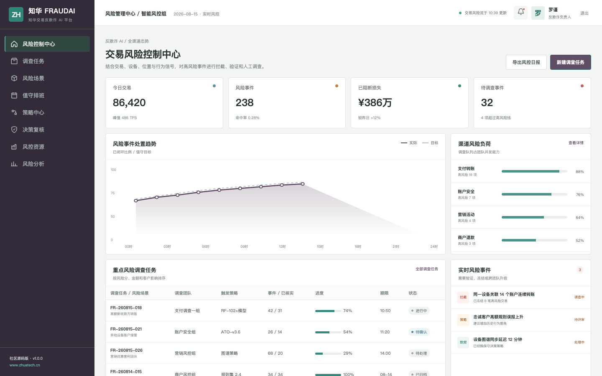
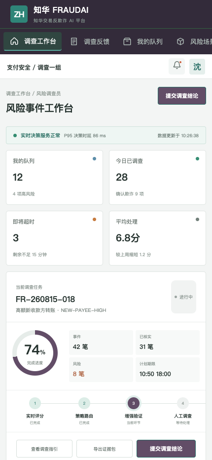

# ZhuaTech FraudAI｜知华交易反欺诈 AI 平台

> 实时发现可疑交易，同时保留规则、模型与人工调查证据。

本项目由 **[知华科技（上海如静知华信息科技有限公司）](https://www.zhuatech.cn/)** 发布，面向个人学习交易风控、实时风险决策、Java AI 系统与 Vue 管理平台。

> [!CAUTION]
> 本工程只允许个人、非商业性的学习研究与技术交流，禁止商用。企业内部使用、生产部署、SaaS、客户交付、收费服务、二次销售或品牌替换，须事先取得上海如静知华信息科技有限公司书面授权。完整条款见 [LICENSE](LICENSE)。

## 风险控制中心



管理端呈现交易量、风险事件、已阻断损失、调查负荷、实时策略与服务健康，方便反欺诈负责人安排处置。

## 风险调查工作台



调查端聚合交易金额、客户基线、设备、位置、交易速度与关系图谱信号，保留人工确认、增强验证和申诉处理入口。

## 决策闭环

```text
交易事件 → 实时特征 → 规则与评分 → ALLOW / CHALLENGE / BLOCK
                                      ↓
                         人工调查 → 结果回流 → 策略复盘
```

- 高额偏离、短时交易速度、设备和位置风险综合评分
- 新收款方、不可能旅行等可解释风险原因
- 正常放行、增强身份验证和冻结调查三种路由
- 风险场景、策略版本、调查任务和决策复核
- 所有冻结与黑名单动作保留人工批准边界
- Java 21、Spring Boot 4、MySQL 8、Vue 3 和 Docker Compose

核心接口 `POST /api/ai/fraud/assess` 是完全本地、确定性、可测试的参考实现，不需要外部 AI API Key。它不包含真实金融机构规则，也不能直接替代合规风控系统。

## 本地运行

```bash
cd frontend
npm install
npm run dev:demo
```

访问 `http://localhost:5173`，管理端 `planner / Demo@2026`，调查端 `operator / Demo@2026`。Java 根包 `cn.zhuatech.fraudai`，文档见 [docs/api.md](docs/api.md)、[docs/architecture.md](docs/architecture.md)和[deploy/README.md](deploy/README.md)。全部演示交易、金额和人员均为虚构数据。

## 商业授权与深度开发

需要交易反欺诈、账户安全、规则引擎、实时数据平台、AI 私有化或软件外包，请联系知华科技：

| 风控方案咨询 | 项目合作咨询 |
| --- | --- |
|  |  |

[访问知华科技官网](https://www.zhuatech.cn/) · SEO：AI 反欺诈、交易风控、Fraud Detection、账户接管检测、Java 风控平台源码、知华科技。
